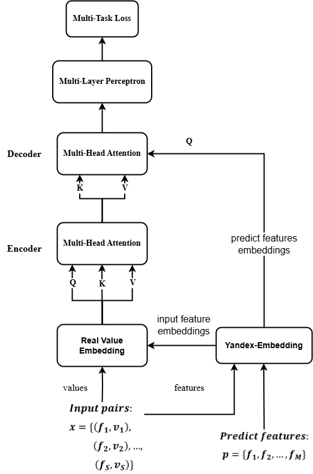

# Leveraging LLM embeddings for tabular data: case of Universal Laboratory Model to predict abnormal clinical outcomes based on routine tests

This is the implementation of the paper
"Leveraging LLM embeddings for tabular data: case of Universal Laboratory Model to predict abnormal clinical outcomes based on routine tests".

📌 Our contributions in the article are as follows:

- We developed a new neural network architecture – the **Universal Laboratory Model (ULM)** – that can effectively model multidimensional laboratory data with missing values using the **attention mechanism** of the **Set Transformer** and internal encodings of key parameters by the **Large Language Model**.
- Applying this architecture to laboratory data, we built accurate models to predict system pathology that can result in **low ferritin**, **high uric acid**, **cholesterol**, and **glucose** levels based on **CBC results** and (if any) other blood tests. The model can be easily expanded for other tests (features).
- We made these models **publicly available** to facilitate their use by Laboratory Information Systems throughout the world. Check out our Universal Laboratory Model at the link: [ULM](https://ulm.roslis.ru).

## Universal Laboratory Model (ULM)

*We propose the **Universal Laboratory Model** that uses context **GPT-like embeddings** for both input and output and can effectively work with **different size sets** thanks to the invariant possibility in the **encoder-decoder** architecture.*

*In four laboratory cases, we demonstrate that the use of ULM can **improve** model performance compared to standard **MLP**, and the models can be used in **laboratory diagnostics**.*

<div align="center">
  
</div>

### Model Architecture

Our approach uses the **Encoder-Decoder pattern**. The attention block has three parameters: queries `Q`, keys `K`, and values `V`.

Given:
- `X` = input data
- `P` = predicting features

The components work as follows:

#### Encoder `E(X)`:
Uses **Self-Attention** where all parameters derive from the model input:

```math
  I = E(X) = Attention(Q = X, K = X, V = X)
```

#### Decoder `D(P, X)`:
Uses predicting features as queries:

```math
  D(P, X) = Attention(Q = P, K = I, V = I)
```

#### GPT-Embeddings Processing:
We preserve GPT-embeddings' intrinsic knowledge by avoiding destructive transformations:

```math
  y_i = GPT_i*v_i + B
```

## Code Overview

The code is organized into several key scripts, each representing a distinct stage or approach in the implementation of the scientific article. Below is a detailed breakdown:

### Core Scripts:
- **`analyte_intervals.py`**  
  *Interval Definition for Analytes*  
  Implements a practical approach to determining analyte intervals using histograms. Our implementation includes building a histogram of all the values of a test, sorting it by them, finding the maximum, and traversing from this point in both directions until the fraction of the cumulative number of visited values is less than the threshold.
  
- **`ml.py`**  
  
  Main script to train a model based on settings in config.ini. Available model types are: single, multi, and ulm - defined in config.ini.
  Copy example config and fill in with your values. As we cannot provide the source data you have to implement a similar to createDatasets function (data.py).

  ## Version

We used python3.11 and Tensorflow 2.18 to build and the our models.


