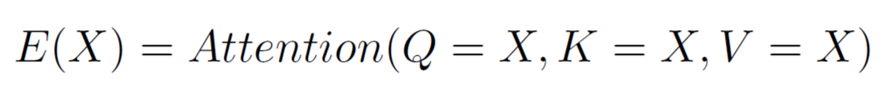
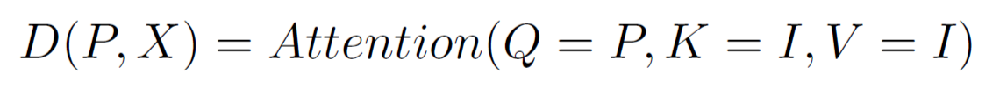
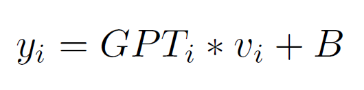

# Leveraging LLM embeddings for tabular data: case of Universal Laboratory Model to predict abnormal clinical outcomes based on routine tests (ICECCME 2025)

This is the official implementation of the paper
"Leveraging LLM embeddings for tabular data: case of Universal Laboratory Model to predict abnormal clinical outcomes based on routine tests".

Our contributions in the article are as follows:

- We developed a new neural network architecture – the **Universal Laboratory Model (ULM)** – that can effectively model multidimensional laboratory data with missing values using the **attention mechanism** of the **Set Transformer** and internal encodings of key parameters by the **Large Language Model**.
- Applying this architecture to laboratory data, we built accurate models to predict system pathology that can result in **low ferritin**, **high uric acid**, **cholesterol**, and **glucose** levels based on **CBC results** and (if any) other blood tests. The model can be easily expanded for other tests (features).
- We made these models **publicly available** to facilitate their use by Laboratory Information Systems throughout the world. Check out the our Universal Laboratory Model at the link: [ULM](https://ulm.roslis.ru).

## Universal Laboratory Model (ULM)

*We propose the **Universal Laboratory Model** that uses context **GPT-like embeddings** for both input and output and can effectively work with **different size sets** thanks to the invariant possibility in the **encoder-decoder** architecture.*

*In four laboratory cases, we demonstrate that the use of ULM can **improve** model performance compared to standard **MLP**, and the models can be used in **laboratory diagnostics**.*

  

### Model Architecture

Our approach uses the **Encoder-Decoder pattern**. The attention block has three parameters: queries `Q`, keys `K`, and values `V`.

Given:
- `X` = input data
- `P` = predicting features

The components work as follows:

#### Encoder `E(X)`:
Uses **Self-Attention** where all parameters derive from the model input:

  

#### Encoder `D(P, X)`:
Uses predicting features as queries:

  

#### GPT-Embeddings Processing:
We preserve GPT-embeddings' intrinsic knowledge by avoiding destructive transformations:

  

- ❌ Prohibited: Matrix multiplications (rotations/squeezing).

- ✅ Allowed: Only scalar operations.

## Code Overview

The code is organized into several key scripts, each representing a distinct stage or approach in the implementation of the scientific article. Below is a detailed breakdown:

### Core Scripts:
- **`ad.py`**  
  *Interval Definition for Analytes*  
  Implements a practical approach to determining analyte intervals using histograms (instead of theoretical probability density integration).  
  *Key nuance*: While papers often describe probability density integration, real-world applications typically rely on histograms.  

- **`one.py`**  
  *Single-Target Prediction*  
  Trains models to predict individual targets (ferritin, glucose, cholesterol, uric acid) using all available data (missing values filled with zeros).  
  - Data restricted to dates before `2025/01/01`.  
  - Predictions are made only for points where all features fall within the model's defined domain.  

- **`multi.py`**  
  *Multi-Target Joint Training*  
  Tests the effect of training a single model to predict all four targets simultaneously.  
  - *Conclusion*: No significant improvement observed compared to single-target models.  

- **`e3.py`**  
  *ULM (Unified Lab Model) Implementation*  
  Proposes a novel architecture:  
  - **Encoder**: Processes GPT embeddings of input lab tests.  
  - **Decoder**: Takes the encoder's output and uses target test embeddings (as queries) to generate predictions.

### Key Observations:
- Practical simplifications (e.g., histograms in `ad.py`) are explicitly acknowledged.  
- The ULM approach (`e3.py`) is the most experimental and innovative part of the codebase.  
- Multi-task learning (`multi.py`) showed no advantage, which is itself a valuable finding.
